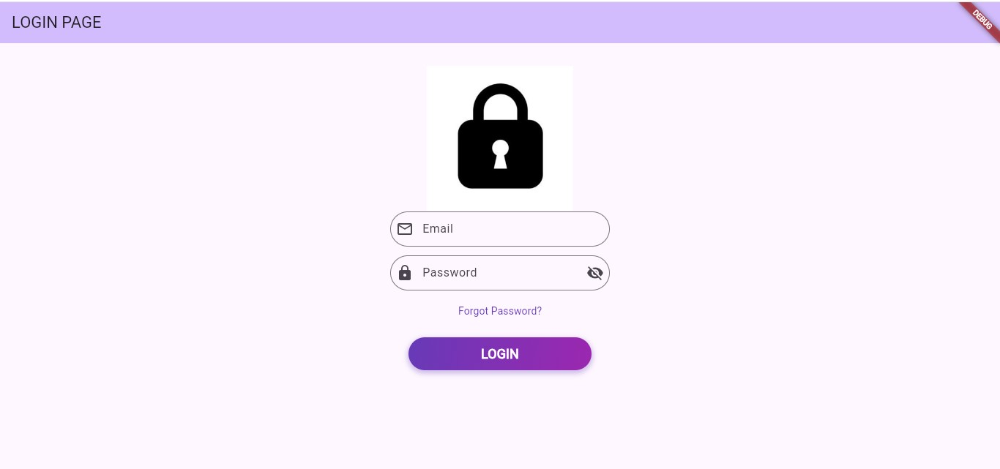
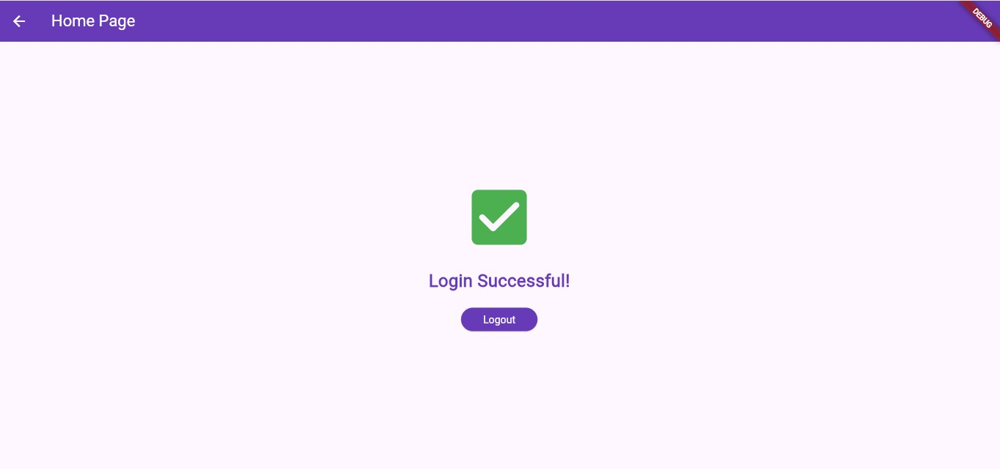

# Faisal Login Project

A simple and elegant Login Screen implementation built with Flutter. This project demonstrates a clean UI with input validation, password visibility toggle, and navigation.

## 📱 Screenshots

## ✨ Features

- **Clean UI**: Modern design using Material 3 and deep purple color scheme.
- **Input Validation**: Checks for empty email and password fields with SnackBar feedback.
- **Password Toggle**: Easily switch between hidden and visible password text.
- **Custom Button**: Login button with a stylish linear gradient and shadow.
- **Navigation**: Smooth transition to a "Home Page" upon successful login.
- **Asset Integration**: Includes an image placeholder for a lock icon.

## Getting Started

## Working
- type anything in the email and password section.

### Installation & Setup

1. **Clone the repository:**
   git clone 

